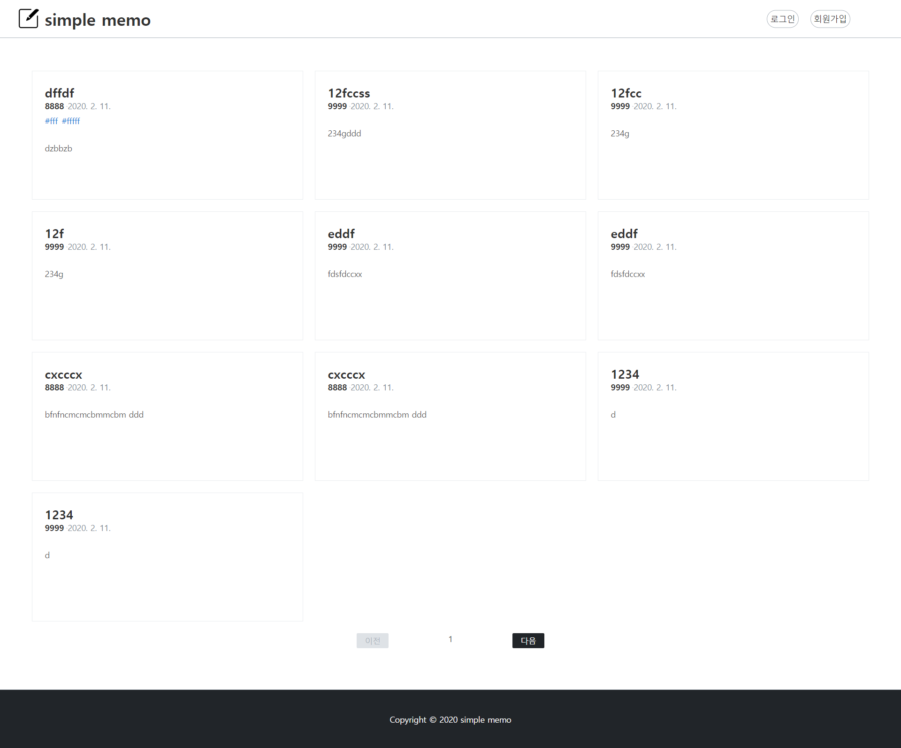
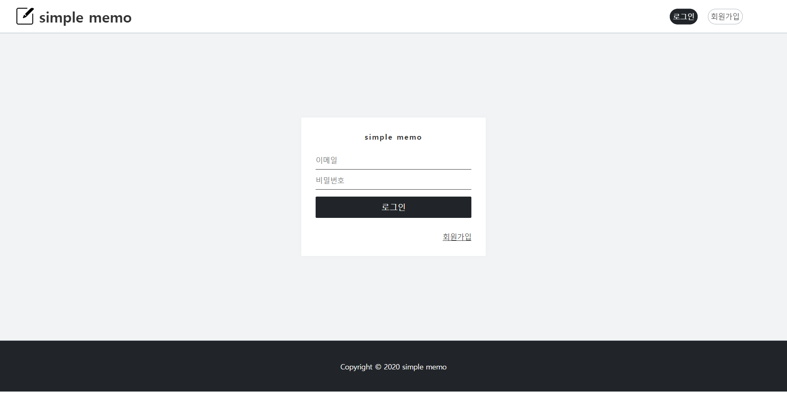
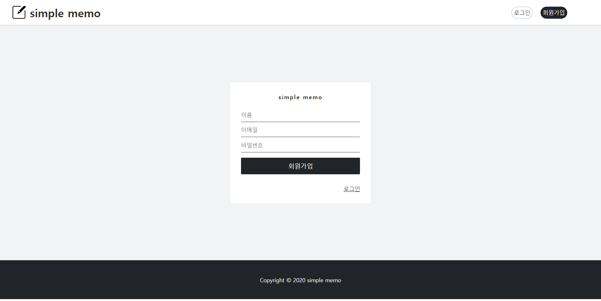
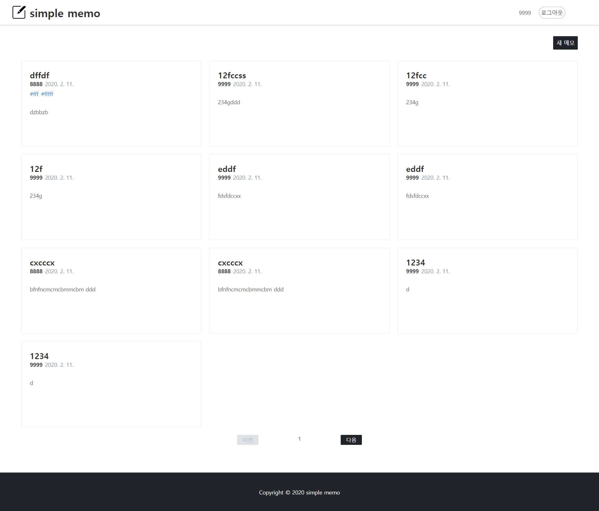
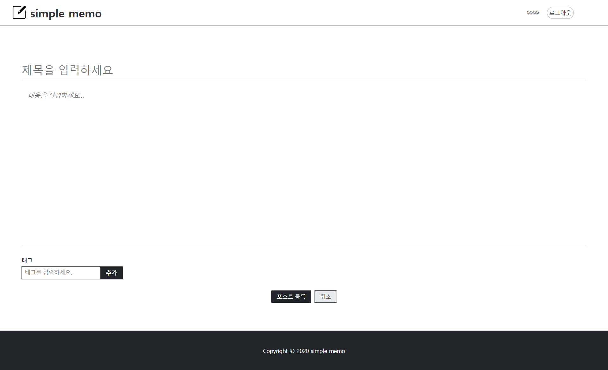
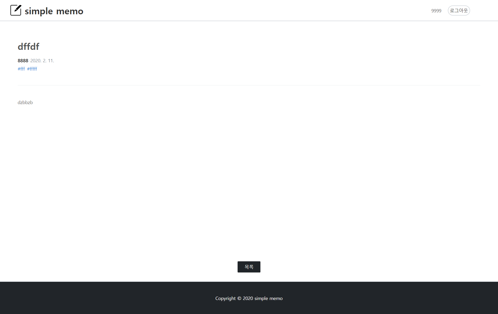
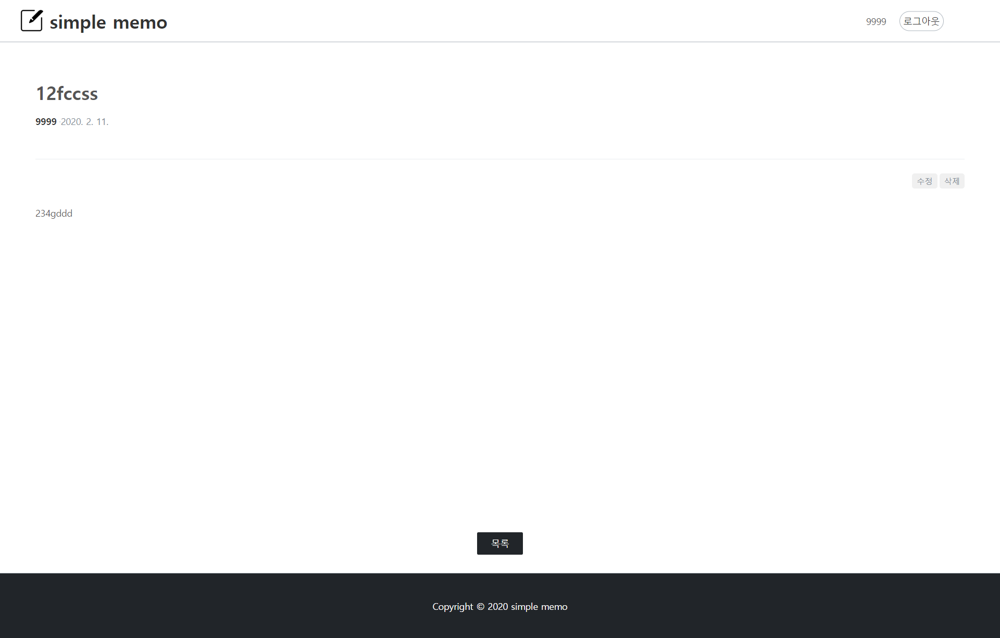
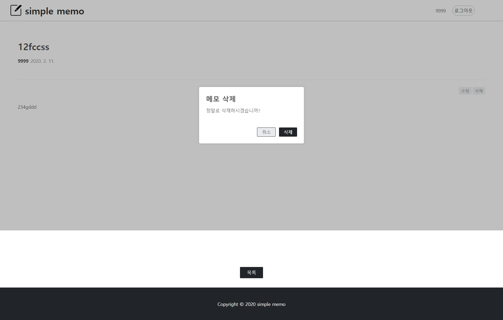
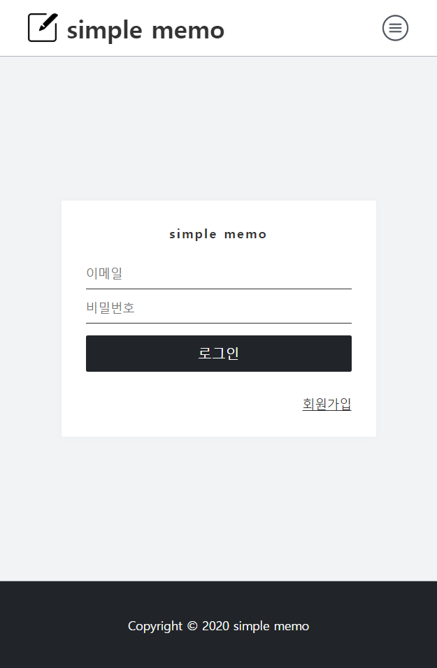
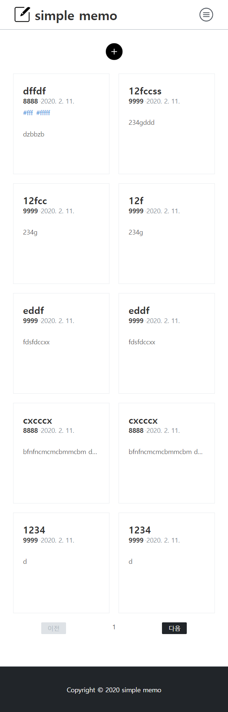

# **반응형 웹 메모장 프론트엔드**

## **프로젝트 일정(목표)**

`2020/01/06` → `2020/02/10`

- 회원
- 메모 관리
- 고정, 보관, 휴지통 기능
- 태그

## 기술

- `React.js`
- `Sass(SCSS)`
- `styled-components`
- `Redux`

## Screen shot

**메인** 

**로그인**

**회원가입**

**로그인후**

**메모쓰기**

**메모읽기**

**자기메모**

**삭제모달**

**모바일 로그인폼**

**모바일 로그인후**

